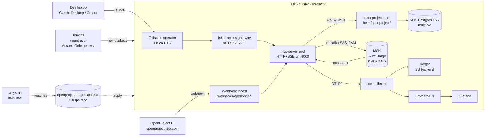

# openproject-mcp

Model Context Protocol server fronting OpenProject, packaged with the
platform that runs it on AWS EKS.

The app itself is a small Python service (`apps/mcp-server/`) - 32 MCP
tools mapped to OpenProject's REST + HAL+JSON API, an HTTP/SSE
transport, a Kafka webhook ingest path, Prometheus metrics, OTLP
tracing. Everything else in this repo is the infra that gets it from
laptop to production cluster: Terraform for AWS, Helm + Kustomize for
K8s, Jenkins for CI/CD, ArgoCD for GitOps, Istio for the mesh,
Knative for the scale-to-zero variant, Tailscale for ingress.

## Architecture



The arrows show one round-trip: a tool call from the laptop hits
Tailscale, terminates TLS at the Istio gateway, lands on the
mcp-server pod, which either calls OpenProject's API directly or
serves a cached webhook event. Webhooks flow OpenProject → ingest
route → Kafka topic `openproject.events.raw` → consumer → in-memory
LRU → MCP `get_recent_events` tool.

## Repo layout

```
apps/
  mcp-server/         Python MCP server (32 tools, HTTP+SSE+stdio)
terraform/
  bootstrap/          S3 + DynamoDB state backend
  modules/{vpc,eks,rds,msk,iam,route53,bastion,observability,vpc_peering}
  envs/{dev,staging,prod}/   profile-per-account stacks
ansible/              dynamic aws_ec2 inventory + bastion + ssh-keys playbooks
helm/
  openproject-mcp/    application chart
  openproject/        OpenProject self-host wrapper chart
  addons/             ESO + sealed-secrets + external-dns
  observability/      kube-prometheus-stack + EFK + jaeger + otel + dashboards
k8s/
  base/               Kustomize base
  overlays/{dev,staging,prod}/
  rbac/  network-policies/  quotas/  cronjobs/
istio/                PeerAuthentication + VS + DR + AuthPolicy + Telemetry
tailscale/            k8s-operator helm install + ACLs.hujson
jenkins/              JCasC Dockerfile + plugins.txt + casc.yaml + Job DSL
argocd/               AppProject + Applications + image-updater config
knative/              ksvc + traffic-split + KafkaSource + Trigger
chaos/                chaos-mesh scenarios + nightly cronjob
load/                 k6 docker-compose + k6-operator EKS manifests + scenarios
scripts/              seed-openproject.py + helpers
Jenkinsfile           declarative pipeline (root)
```

## Related repos

| Repo | Purpose |
|---|---|
| `openproject-mcp-charts` | Published Helm chart repo (GitHub Pages, gh-pages branch) |
| [`openproject-mcp-manifests`](https://github.com/csye7125-CloudJourney/openproject-mcp-manifests) | ArgoCD's GitOps target - Kustomize overlays per env |
| [`openproject-mcp-operator`](https://github.com/csye7125-CloudJourney/openproject-mcp-operator) | Go operator (Kubebuilder) for the `OpenProjectMCP` CRD |

Each is its own git repo. Jenkins publishes the chart, bumps the
image tag in the manifests repo, and ArgoCD picks it up.

## Quickstart (local)

Runs as a plain Python process against any OpenProject instance. AWS
and Kafka are only needed for the platform deploy further down.

```bash
cd apps/mcp-server
python -m venv .venv && source .venv/bin/activate
pip install -e .[dev]

# secrets live outside the repo
mkdir -p ~/.config/openproject-mcp
cat > ~/.config/openproject-mcp/.env.local <<EOF
OPENPROJECT_URL=https://your-openproject.example.com
OPENPROJECT_API_KEY=...
EOF
chmod 600 ~/.config/openproject-mcp/.env.local

# stdio (Claude Desktop default)
set -a; source ~/.config/openproject-mcp/.env.local; set +a
python -m openproject_mcp_server

# or HTTP+SSE on :8000
MCP_TRANSPORT=http python -m openproject_mcp_server
```

Hook it into Claude Desktop:

```jsonc
// claude_desktop_config.json
{
  "mcpServers": {
    "openproject": {
      "command": "python",
      "args": ["-m", "openproject_mcp_server"],
      "env": {
        "OPENPROJECT_URL": "...",
        "OPENPROJECT_API_KEY": "..."
      }
    }
  }
}
```

Docker variant:

```bash
docker compose -f apps/mcp-server/docker-compose.yml up
```

Full local platform (OpenProject + memcached + MCP), useful before
Helm:

```bash
docker compose -f docker-compose.openproject.yml up
```

App-level dev loop: `pip install -e .[dev]`, then `pytest -q` in
`apps/mcp-server/`. `ruff check .` for lint.

## Production deploy

End-to-end from empty AWS account to a running platform.

1. **Bootstrap state backend.** S3 bucket + DynamoDB lock table per
   env. One-time, per account.
   ```bash
   cd terraform/bootstrap
   terraform init && terraform apply -var aws_profile=openproject-mcp-prod
   ```
2. **Provision infra.** VPC + EKS + RDS + MSK + IAM (IRSA roles) +
   Route53 + observability log groups.
   ```bash
   cd terraform/envs/prod
   terraform init && terraform apply
   ```
   ~15 min on cold apply.
3. **Configure kubectl.**
   ```bash
   aws eks update-kubeconfig --name mcp-prod --region us-east-1 \
     --profile openproject-mcp-prod
   ```
4. **Install Tailscale operator.** Provides ingress without a public
   ALB. `tailscale/k8s-operator.tf` runs as a separate Terraform
   stack; `terraform -chdir=tailscale init && terraform apply`.
5. **Install platform addons.** ESO + sealed-secrets + external-dns,
   in that order (their CRDs are pre-reqs for the app chart).
   ```bash
   helm install addons helm/addons/ -n addons --create-namespace \
     -f helm/addons/values-prod.yaml
   ```
6. **Install Istio.** `istioctl install` with the operator chart;
   manifests under [`istio/`](istio/) apply on top
   (PeerAuthentication STRICT, default-deny AuthorizationPolicy).
7. **Install observability stack.** prom + grafana + alertmanager +
   EFK + jaeger + otel-collector, one wrapper chart.
   ```bash
   helm install observability helm/observability/ -n observability \
     --create-namespace -f helm/observability/values-prod.yaml
   ```
8. **(Optional) Self-host OpenProject.** Only if you don't have an
   external instance.
   ```bash
   helm install openproject helm/openproject/ -n openproject \
     --create-namespace -f helm/openproject/values-prod.yaml
   ```
9. **Deploy the MCP server.** Jenkins does this on every push to
   `main`; manual path:
   ```bash
   helm install openproject-mcp helm/openproject-mcp/ \
     -n openproject-mcp --create-namespace \
     -f helm/openproject-mcp/values-prod.yaml \
     --set image.tag=$(cat apps/mcp-server/VERSION) \
     --set serviceAccount.roleArn=$(cd terraform/envs/prod && terraform output -raw irsa_role_arn_mcp_server)
   ```
10. **Install ArgoCD + the operator** (optional, GitOps + CRD path).
    `helm install argocd argo/argo-cd -n argocd --create-namespace`,
    then apply `argocd/projects/` and `argocd/applications/`.
11. **Install Knative serving + eventing** (optional, scale-to-zero
    variant). `kubectl apply -f knative/` after the upstream Knative
    operator is up.

Jenkins pipeline that automates 5 → 9 with `--atomic` rollback is at
[`Jenkinsfile`](Jenkinsfile) (declarative). Push (Jenkins) and pull
(ArgoCD) paths are both wired.

## MCP tools

32 tools across 9 domains. Verify with
`grep -h 'name="' apps/mcp-server/src/openproject_mcp_server/tools/*.py | wc -l`.

### projects
- `list_projects` - list all accessible OpenProject projects
- `get_project_details` - detailed info about a project
- `create_project` - create a new project
- `update_project` - update name or description
- `delete_project` - delete by id

### work_packages
- `list_work_packages` - list with optional filtering
- `get_work_package` - detailed info about one
- `create_work_package` - create a new one
- `update_work_package` - subject / description / status / etc.
- `delete_work_package` - delete by id

### users
- `list_users` - list all users
- `get_user` - fetch a single user by id

### time_entries
- `list_time_entries` - list, optionally filter by work package
- `create_time_entry` - log time against a work package

### lookups
- `list_statuses` - work package statuses
- `list_types` - work package types
- `list_priorities` - work package priorities

### memberships
- `list_memberships` - list project memberships
- `create_membership` - add a user to a project with a role

### relations
- `list_relations` - relations for a work package
- `create_relation` - link two work packages
- `list_watchers` - watchers on a work package
- `add_watcher` - add a user as a watcher

### misc
- `list_attachments` - attachments on a work package
- `list_categories` - categories for a project
- `list_versions` - versions for a project
- `create_version` - create a version
- `list_activities` - changes/comments on a work package
- `list_queries` - saved queries
- `search_work_packages` - free-text search
- `get_project_hierarchy` - project tree

### events (webhook-fed)
- `get_recent_events` - recent OpenProject events from the in-memory
  cache populated by the Kafka consumer. The one tool whose data
  doesn't come from a direct OpenProject API call.

All tools instrumented with Prometheus histograms
(`openproject_mcp_tool_calls_total`, `openproject_mcp_tool_latency_seconds`)
and OTel spans when `OTEL_ENABLED=true`.

## Observability

- prometheus + grafana + alertmanager (via kube-prometheus-stack)
- EFK: elasticsearch + kibana + fluent-bit DaemonSet
- jaeger backed by the same elasticsearch
- OpenTelemetry collector between the app and prom/jaeger
- app emits OTLP spans via `apps/mcp-server/src/openproject_mcp_server/tracing.py`
  (gated by `OTEL_ENABLED=true`)

Wired as one wrapper chart: [`helm/observability/`](helm/observability/).
Dashboards are baked into a configmap in the chart; access them by
port-forwarding grafana or hitting `grafana.<tailnet>.ts.net`.

## Tests

```bash
cd apps/mcp-server
pytest -q
# 127 tests covering the tool surface plus the webhook ingest path
```

Operator tests live in the separate repo:

```bash
cd ../../openproject-mcp-operator
go test ./internal/controller/...
# 6 reconcile-loop tests
```
