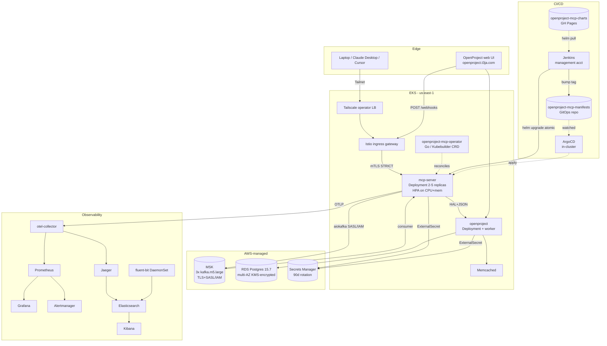
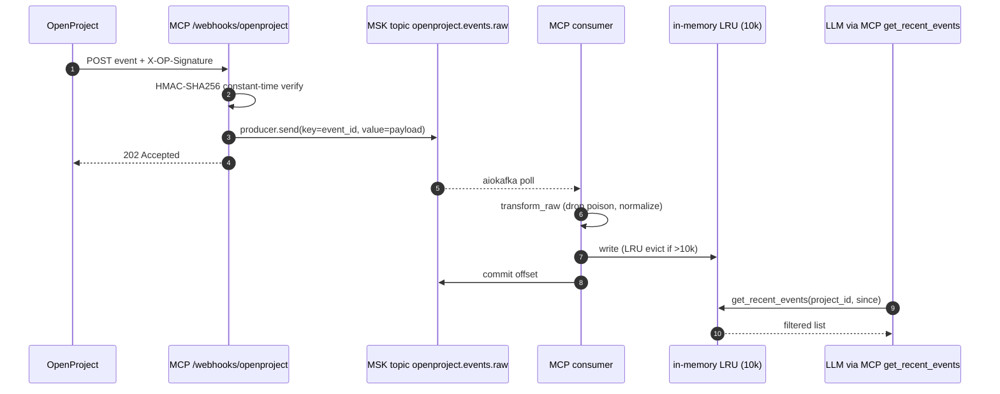
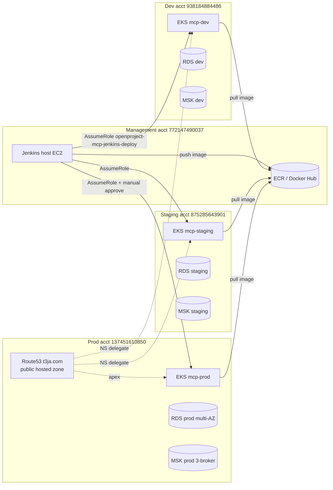

# Architecture

System diagram, the webhook sequence, then the multi-account topology.
Component table at the bottom maps each piece to where it lives in the
repo and what it depends on.

## System

## Webhook sequence (push path)

The non-obvious part: webhook ingest returns 202 *before* Kafka has
acked the produce. That gives OpenProject's webhook retry loop a
predictable ceiling on latency (target p95 < 50ms at the ingest
route, separate from the Kafka-to-cache p95 < 5s SLO). If MSK is
unavailable the route falls back to 503 and OpenProject's retry
budget takes over.

## Deployment topology

State backends + KMS keys per env, never shared across accounts.
Subdomain pattern `mcp-dev.t3ja.com`, `mcp-staging.t3ja.com`,
`mcp.t3ja.com` matches the CSYE6225 convention I carried over.

## Component table

| Piece | Where in repo | Depends on | Notes |
|---|---|---|---|
| MCP server | `apps/mcp-server/` | OpenProject API, MSK, otel-collector | 32 tools, HTTP+SSE+stdio |
| Webhook ingest | `apps/mcp-server/src/openproject_mcp_server/webhooks/` | HMAC secret, MSK | 202-first design |
| Kafka consumer | same | MSK SASL/IAM | manual commit after cache write |
| Events cache | same | none | bounded LRU 10k + project index |
| Helm app chart | `helm/openproject-mcp/` | ESO, sealed-secrets, Istio CRDs | values per env |
| Helm OpenProject wrapper | `helm/openproject/` | external RDS, in-cluster memcached | subchart pin 8.0.0 |
| Helm observability | `helm/observability/` | kube-prometheus-stack, ES, Jaeger, OTel | sidecar dashboards |
| Helm addons | `helm/addons/` | ESO, sealed-secrets, external-dns | install order: this first |
| Kustomize | `k8s/` | nothing external | base + 3 env overlays |
| Istio | `istio/` | EKS + istio CRDs | mTLS STRICT + default-deny AuthPolicy |
| Terraform | `terraform/` | bootstrap (S3+DDB) | env per dir, profile per acct |
| Ansible | `ansible/` | dynamic aws_ec2 inventory | bastion + ssh-keys + networking |
| Jenkins | `jenkins/` | Docker host + AssumeRole IAM | JCasC-provisioned, multibranch pipeline |
| ArgoCD | `argocd/` + `openproject-mcp-manifests` repo | EKS + sealed-secrets | image updater on dev/staging |
| Knative | `knative/` | Istio + KnativeServing operator | scale-to-zero variant + KafkaSource |
| Operator | separate repo `openproject-mcp-operator/` | EKS + cert-manager | `OpenProjectMCP` CRD, Go/Kubebuilder |
| Load harness | `load/` | k6-operator on EKS | webhooks + 20 MCP tools scenarios |
| Chaos | `chaos/` | chaos-mesh 2.7 | pod-kill, net-latency, broker-kill |
| Tailscale | `tailscale/` | EKS + auth key | k8s-operator + ACLs |

## Why these specific choices

Helm gives templating, Kustomize gives the overlay model ArgoCD wants, so both live side-by-side. Jenkins-direct deploys use the Helm path; ArgoCD reconciles the Kustomize overlays in the manifests repo.

Jenkins owns the push deploy contract end-to-end (semver bump, image build, trivy scan, helm upgrade, smoke check, promote, rollback). GitHub Actions only runs lint and tests on PRs - it never touches a cluster.

Push and pull are both wired. Push (Jenkins helm upgrade) is the deploy default. Pull (ArgoCD watching the manifests repo, Image Updater writing tags back) is wired so the GitOps loop is observable end-to-end.
